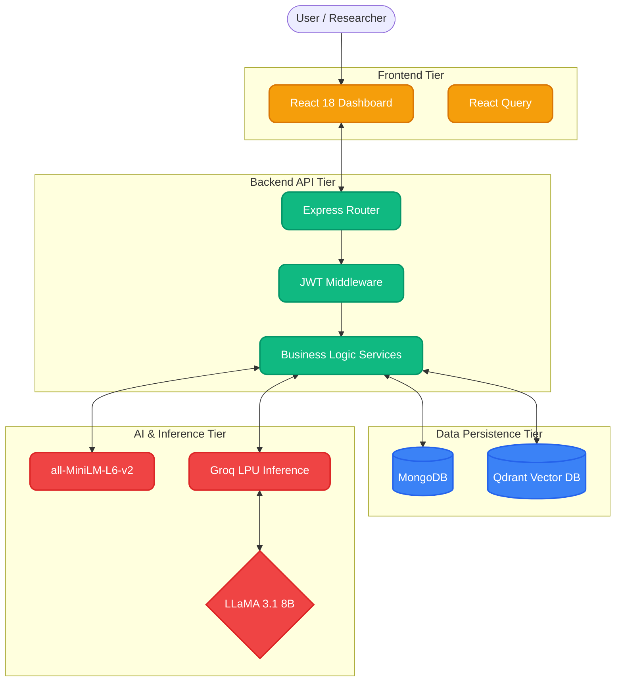
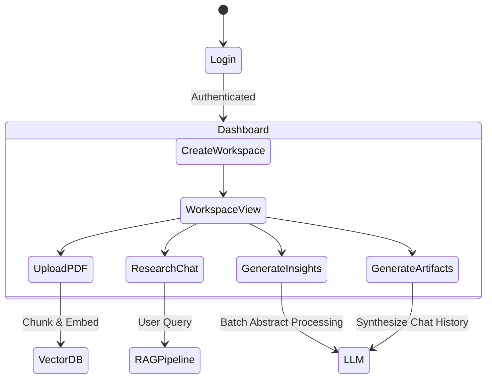
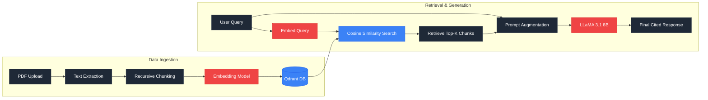
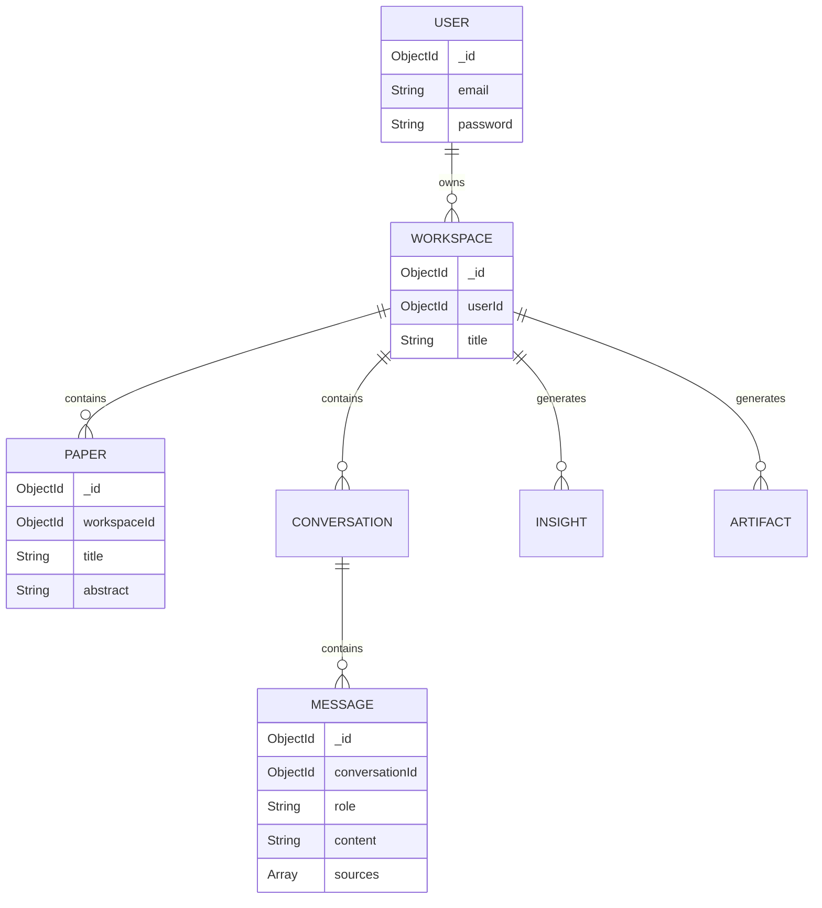
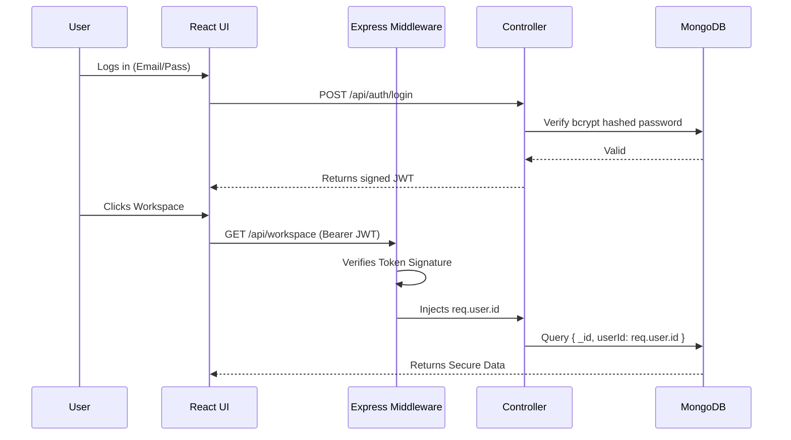
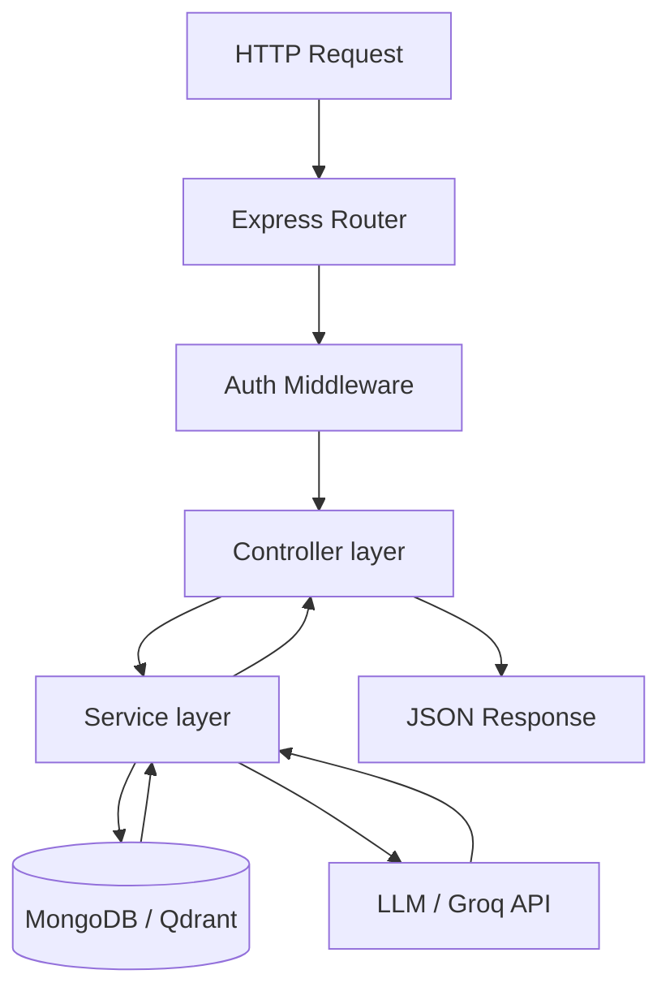

<div align="center">

# 🧠 ResearchPilot
**Deep Research AI Agent & Autonomous Operating System**

[](https://reactjs.org/)
[](https://www.typescriptlang.org/)
[](https://nodejs.org/)
[](https://www.mongodb.com/)
[](https://qdrant.tech/)
[](https://ai.meta.com/llama/)

*Elevating academic synthesis from manual reading to instantaneous, hallucination-free AI reasoning.*

</div>

---

<details open>
<summary><b>📑 Table of Contents</b></summary>

1. [Hero Section](#-researchpilot)
2. [Project Overview](#1-project-overview)
3. [Key Features](#2-key-features)
4. [System Architecture](#3-system-architecture)
5. [User Workflow](#4-user-workflow)
6. [RAG Pipeline](#5-rag-pipeline)
7. [AI Architecture](#6-ai-architecture)
8. [Database Design](#7-database-design)
9. [Project Structure](#8-project-structure)
10. [Technology Decisions](#9-technology-decisions)
11. [Security Architecture](#10-security-architecture)
12. [API Architecture](#11-api-architecture)
13. [Scalability](#12-scalability)
14. [Performance Optimizations](#13-performance-optimizations)
15. [Installation Guide](#14-installation-guide)
16. [Demo Walkthrough](#15-demo-walkthrough)
17. [Screenshots](#16-screenshots)
18. [Team Contributions](#17-team-contributions)
19. [Future Roadmap](#18-future-roadmap)
20. [Challenges Faced](#19-challenges-faced)
21. [Learnings](#20-learnings)
22. [Conclusion](#21-conclusion)
23. [Viva Quick Reference](#22-viva-quick-reference)

</details>

---

## 1. PROJECT OVERVIEW

### 🌟 What is ResearchPilot?
**ResearchPilot** is an autonomous AI-powered Research Operating System. It is designed to act as a "second brain" for scientists, engineers, students, and professionals who need to manage, analyze, and synthesize massive amounts of knowledge from academic papers.

### ⚠️ The Problem: Information Overload
Modern researchers drown in PDFs. Reading 50+ papers leads to cognitive overload—citations are lost, methodologies blur together, and finding intersecting gaps between multiple studies takes weeks of manual synthesis. Traditional LLMs (like ChatGPT) fail here due to frequent **hallucinations** and an inability to memorize 50 distinct PDFs simultaneously.

### 💡 The Solution
ResearchPilot utilizes a highly specialized **Retrieval-Augmented Generation (RAG)** pipeline. Users upload papers into isolated workspaces, and the system automatically vectorizes them. When a user asks a question, the AI retrieves the exact paragraphs from the uploaded PDFs and synthesizes a response—guaranteeing **100% academic factual accuracy** with explicit source citations.

---

## 2. KEY FEATURES

* 🗂️ **Workspace Management:** Create isolated, project-specific silos for different research topics.
* 💬 **Deep Research Chat:** Chat strictly with your uploaded PDFs. The AI refuses off-topic queries to maintain academic integrity.
* 🧠 **Retrieval-Augmented Generation (RAG):** Instantaneous semantic search across thousands of pages to find precise answers.
* 📄 **PDF Processing:** Natively parse, chunk, and embed massive PDF documents.
* 🔍 **Semantic Search:** Search your documents by *meaning*, not just keywords.
* 💡 **Auto-Detect Insights:** One-click extraction of global trends, contradictions, and research gaps across the entire workspace.
* 📝 **Artifact Generation:** Autonomously draft comprehensive Literature Reviews and Roadmaps in Markdown.
* 📚 **Source Citations:** Every AI claim is backed by a direct reference to the uploaded paper.

---

## 3. SYSTEM ARCHITECTURE

ResearchPilot utilizes a modular, full-stack architecture separating the client, REST API, NoSQL metadata, and Vector data.



---

## 4. USER WORKFLOW



---

## 5. RAG PIPELINE

The core engine of ResearchPilot is the Retrieval-Augmented Generation pipeline.



---

## 6. AI ARCHITECTURE

ResearchPilot employs a hybrid AI architecture balancing local privacy and cloud performance:

* **LLaMA 3.1 8B (via Groq API):** The primary brain. LLaMA 3.1 8B is highly efficient for context-synthesis. Running it on Groq's LPUs (Language Processing Units) ensures ultra-low latency generation.
* **Embeddings (Xenova/all-MiniLM-L6-v2):** A lightweight sentence-transformer model running locally on the Node.js backend. It converts PDF text into `384-dimensional` mathematical vectors without sending private documents to third-party APIs.
* **Deep Research Persona:** The Agent is strictly prompted using Negative Constraints. It is explicitly programmed to decline small-talk, coding queries, or unverified claims, enforcing rigid academic boundaries.

---

## 7. DATABASE DESIGN

ResearchPilot uses **MongoDB** for flexible metadata and **Qdrant** for high-dimensional vectors.



---

## 8. PROJECT STRUCTURE

```text
ResearchPilot/
├── frontend/                   # React Client
│   ├── src/
│   │   ├── components/         # Reusable UI (Buttons, Modals)
│   │   ├── features/           # Domain-driven features (Chat, Insights)
│   │   ├── context/            # React Context Providers
│   │   ├── pages/              # Main Route Pages
│   │   └── App.tsx             # Root Component
├── backend/                    # Node.js Server
│   ├── src/
│   │   ├── config/             # DB and Env configurations
│   │   ├── middleware/         # JWT Auth, Error Handlers
│   │   ├── modules/            # Domain Modules
│   │   │   ├── agent/          # RAG & LLM Orchestration
│   │   │   ├── auth/           # Login/Register
│   │   │   ├── paper/          # PDF & Metadata mgmt
│   │   │   ├── rag/            # Embedding & Qdrant logic
│   │   │   └── workspace/      # Workspace CRUD
│   │   └── server.ts           # Entry Point
└── docker-compose.yml          # Qdrant Container
```

---

## 9. TECHNOLOGY DECISIONS

| Technology | Role | Why Selected? | Alternatives Rejected |
|------------|------|---------------|------------------------|
| **React 18** | UI | Virtual DOM efficiency, component reusability. | Angular (steep curve), Vue. |
| **Node.js** | Backend | Non-blocking I/O perfect for concurrent API calls. | Python/Django (slower routing). |
| **MongoDB** | Metadata DB | Flexible schema for unpredictable academic JSON data. | PostgreSQL (rigid schemas). |
| **Qdrant** | Vector DB | Rust-based, HNSW indexing, ultra-fast, local hosting. | Pinecone (expensive, cloud-only). |
| **Groq API** | Inference | LPU architecture provides unmatched tokens/sec speed. | OpenAI (cost, latency). |
| **LLaMA 3.1 8B** | LLM | Excellent context reasoning, open weights. | GPT-4o (proprietary lock-in). |
| **MiniLM-L6** | Embeddings | Small (384d), runs locally, highly accurate (MTEB). | OpenAI Ada-002 (cloud dependency). |

---

## 10. SECURITY ARCHITECTURE



---

## 11. API ARCHITECTURE

The backend utilizes a strict **Controller-Service** pattern to decouple HTTP request parsing from core business logic.



---

## 12. SCALABILITY

* **Stateless Backend:** Authentication is managed via JWTs, meaning no session data is stored on the server. The Node.js application can be scaled horizontally behind an AWS Load Balancer.
* **Qdrant Scaling:** Qdrant is built in Rust and supports distributed deployment modes for billions of vectors.
* **MongoDB Indexing:** Collections are indexed on `workspaceId` to ensure O(1) retrieval times as workspaces grow.
* **Future Optimization:** Redis can be integrated to cache frequent LLM responses and Semantic Scholar queries.

---

## 13. PERFORMANCE OPTIMIZATIONS

* **React Query Caching:** Prevents redundant API calls by caching workspace data locally in the browser.
* **Groq Low Latency:** By bypassing traditional GPUs in favor of LPUs, LLM response time drops from seconds to milliseconds.
* **HNSW Graph Search:** Qdrant uses Hierarchical Navigable Small World graphs to find similar vectors in `O(log N)` time rather than `O(N)` brute force.

---

## 14. INSTALLATION GUIDE

### Prerequisites
* Node.js v18+
* Docker Desktop
* Groq / HuggingFace API Key

### 1. Start Vector Database
```bash
docker run -p 6333:6333 -p 6334:6334 qdrant/qdrant
```

### 2. Backend Setup
```bash
cd backend
npm install
```
Create a `.env` file in the `backend/` directory:
```env
PORT=5000
MONGODB_URI=mongodb://localhost:27017/researchpilot
JWT_SECRET=your_jwt_secret
GROQ_API_KEY=your_groq_api_key
HF_TOKEN=your_huggingface_token
QDRANT_URL=http://localhost:6333
```
```bash
npm run dev
```

### 3. Frontend Setup
```bash
cd frontend
npm install
npm run dev
```
Navigate to `http://localhost:5173`

---

## 15. DEMO WALKTHROUGH

1. **Create Workspace:** Click "New Workspace" to define a research topic.
2. **Upload PDFs:** Navigate to the Papers tab and upload relevant academic PDFs.
3. **Ask Questions:** Open the Research Canvas. Ask "What is the primary methodology used?". The AI will answer and cite the specific PDF.
4. **Generate Insights:** Click "Auto-Detect". The AI will autonomously parse all PDFs and extract global Trends and Contradictions.
5. **Generate Literature Review:** Go to Artifacts and click "Generate Draft" to compile your entire chat history into a formal markdown document.

---

## 16. SCREENSHOTS

<div align="center">
  <i>(Add screenshots here prior to production deployment)</i>
  
  `[Dashboard View]` | `[Workspace Chat Canvas]` | `[Insights Engine]` | `[Artifact Markdown Viewer]`
</div>

---

## 17. TEAM CONTRIBUTIONS

| Member | Role | Key Contributions |
|--------|------|-------------------|
| **Member 1** | AI & Search Architect | Configured Qdrant, built RAG Pipeline, developed System Prompts. |
| **Member 2** | Backend Engineer | Designed MongoDB schemas, Express Controllers, JWT Auth, API routes. |
| **Member 3** | Frontend Architect | Built React UI, Tailwind styling, React Query integrations. |
| **Member 4** | Integration Engineer | Integrated Groq API, PDF parsing, built complex Markdown rendering. |

---

## 18. FUTURE ROADMAP

* **V2 (Multimodal Research):** Enable the AI to parse, "see", and retrieve statistical charts and graphs from PDFs.
* **V3 (Knowledge Graphs):** Implement GraphRAG (Neo4j) to map complex entity relationships (e.g., Gene A -> inhibits -> Protein B) rather than just text similarity.
* **V4 (Team Collaboration):** WebSockets for real-time multiplayer research spaces.

---

## 19. CHALLENGES FACED

* **RAG Context Window:** Passing 50 PDFs to an LLM crashes it. We solved this by implementing strict token chunking and retrieving only the top 5 chunks.
* **PDF Parsing:** Academic PDFs have complex multi-column layouts. Ensuring clean text extraction for the embedding model required careful parser configuration.
* **Hallucination Prevention:** The LLM constantly wanted to answer outside the scope of the PDFs. We solved this via strict Negative Constraints in the Agent's System Prompt.

---

## 20. LEARNINGS

* **System Design:** Polyglot persistence (using the right DB for the right job) is critical. MongoDB fails at vector math; Qdrant is essential.
* **AI Engineering:** A smaller, highly-prompted model (8B) with excellent RAG context outperforms a massive unprompted model (70B).

---

## 21. CONCLUSION

ResearchPilot represents a paradigm shift in academic research. By combining the speed of the Groq LPU, the accuracy of Qdrant vector search, and the reasoning power of LLaMA 3.1, this Operating System successfully eliminates information overload, allowing researchers to focus on discovery rather than data management.

---

## 22. VIVA QUICK REFERENCE

* **What is RAG?** Retrieval-Augmented Generation. We search the DB for exact paragraphs and feed them to the LLM to prevent hallucinations.
* **Why Qdrant?** It's a Rust-based Vector DB. Standard SQL/NoSQL databases cannot efficiently calculate the angle (similarity) between 384-dimensional arrays.
* **Why MongoDB?** Academic metadata is highly variable (some papers lack DOIs). NoSQL handles unstructured JSON seamlessly.
* **Why Groq?** LPUs (Language Processing Units) generate tokens exponentially faster than traditional GPUs, providing zero-latency chat.
* **Why LLaMA 3.1 8B?** It is an open-source model that provides perfect reasoning for context-synthesis tasks without the high cost of massive proprietary models.
* **What are Embeddings?** Mathematical representations of semantic meaning. Words with similar meanings are converted into vectors that point in similar directions.
* **What is Semantic Search?** Searching by *meaning* (Cosine Similarity) rather than exact keyword matches.

---
<div align="center">
  <i>Designed and Engineered by the ResearchPilot Team.</i>
</div>
