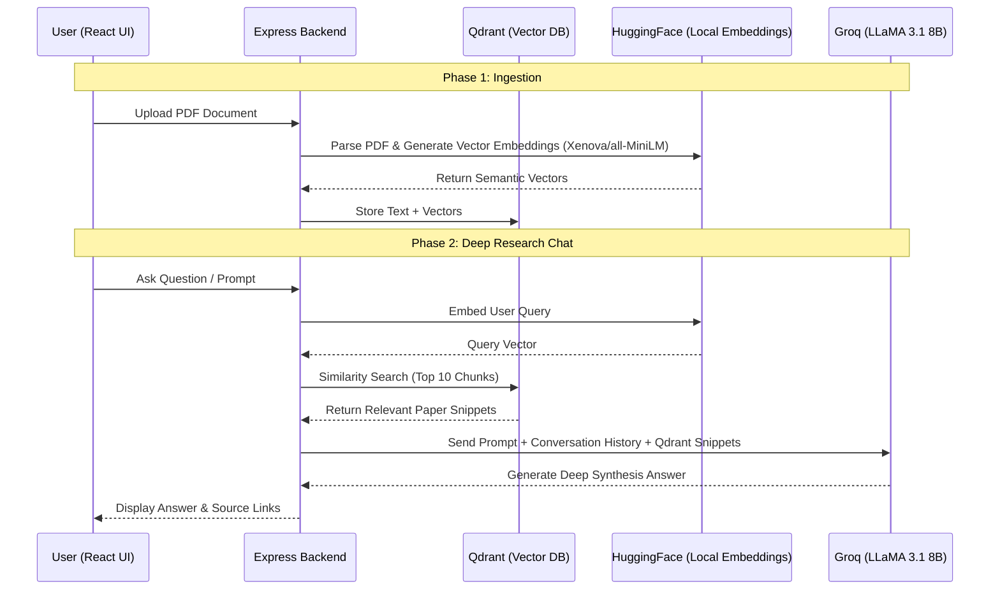

# ResearchPilot: Deep Research AI Agent
**Comprehensive Project Report**

---

## 1. Introduction & Overview
**ResearchPilot** is an advanced, autonomous AI research assistant designed to act as an operating system for literature review and document synthesis. In an era where researchers and professionals are overwhelmed by the sheer volume of academic papers and PDFs, ResearchPilot solves the problem of information overload. By ingesting multiple documents into a centralized workspace, it utilizes Retrieval-Augmented Generation (RAG) to allow users to "chat" directly with their data, extract profound insights, and automatically draft extensive literature reviews and artifacts. 

Unlike standard chatbots, ResearchPilot employs a "Deep Research" persona, synthesizing information across multiple sources, plotting roadmaps via Mermaid flow diagrams, and operating autonomously to deliver polished, expert-level briefings.

---

## 2. System Architecture & Tech Stack
The system is built on a modern, highly scalable, full-stack JavaScript/TypeScript architecture.

### 2.1 Frontend
- **Framework:** React 18, Vite, TypeScript.
- **Styling:** TailwindCSS, ensuring a responsive, glassmorphic, and premium UI.
- **State Management:** React Query (`@tanstack/react-query`) for robust server state synchronization and caching.
- **Rendering:** `react-markdown` for displaying complex agent responses, including Mermaid diagrams and tables.

### 2.2 Backend
- **Framework:** Node.js, Express.js, TypeScript.
- **Architecture:** Modular controller-service pattern separating business logic, routing, and data access.
- **Database (App State):** MongoDB (Mongoose) for managing users, workspaces, conversations, chat histories, and artifact metadata.
- **Database (Vector State):** Qdrant Vector Database (running via Docker) for high-performance, high-dimensional similarity search.

### 2.3 AI Models & Embedding Stack
- **Text Embeddings:** `@huggingface/transformers` (`Xenova/all-MiniLM-L6-v2`) used locally in the Node.js backend. This allows for free, highly efficient, and private vectorization of user PDFs.
- **Generative Model:** Meta's **LLaMA 3.1 8B** accessed via the **Groq API**. Groq's LPU (Language Processing Unit) inference engine provides blistering fast generation speeds, which is critical when processing extensive RAG contexts.

---

## 3. Core Features & Workflow Architecture

The core workflow relies on an orchestration of specialized tools across the stack. Here is the high-level operational diagram:

### Task-to-Technology Mapping:

| Task | Technology/Tool Used | Why this tool? |
| :--- | :--- | :--- |
| **User Interface & State** | React 18, Vite, TailwindCSS | Provides a highly responsive, fast, and modern glassmorphic interface. |
| **API & Business Logic** | Node.js, Express.js, TypeScript | Scales easily, supports async I/O efficiently for handling multiple requests. |
| **PDF Parsing** | `pdf-parse` (NPM package) | Quickly extracts raw text from user-uploaded academic papers. |
| **Data Chunking & Embedding** | `@huggingface/transformers` | Runs completely locally on the Node backend, saving API costs and ensuring data privacy. |
| **Vector Storage & Retrieval** | Qdrant (Docker) | High-speed semantic similarity search, capable of returning the most relevant chunks in milliseconds. |
| **LLM Inference (Generation)**| Groq API (LLaMA 3.1 8B) | Groq's LPU architecture provides instant text generation, crucial for processing large RAG contexts without user delay. |
| **Metadata Storage** | MongoDB & Mongoose | Flexible NoSQL schema perfectly suited for storing user profiles, chat history arrays, and artifact metadata. |

### The Standard User Flow:
1. **Workspace Initialization:** A user creates a Workspace and uploads multiple PDF research papers.
2. **Ingestion & Vectorization:** The backend parses the PDFs (`pdf-parse`), chunks the text, runs it through the HuggingFace embedding model, and stores the semantic vectors in Qdrant.
3. **Deep Conversational Chat:** The user interacts with the Chat interface. The backend searches Qdrant for the top 10 most relevant text snippets across *all* uploaded papers and passes them to LLaMA 3.1.
4. **Insight Extraction:** With a single click, the agent analyzes the recent chat history and extracts profound "Aha!" moments, saving them permanently to the Insights Library.
5. **Artifact Generation:** The user prompts the agent with a topic. The agent fetches relevant context, disregards conversation history, and autonomously writes a massive, formatted Markdown literature review or roadmap.

---

## 4. Agentic Capabilities: What Makes It Special?
ResearchPilot is not a simple "Wrapper" around an LLM. It exhibits true agentic behaviors:

- **Autonomy in Retrieval:** When asked a question, it autonomously decides what context to pull from the Qdrant database without user intervention.
- **Deep Synthesis vs. Summarization:** Rather than summarizing a single text, the system prompt strictly enforces "Deep Synthesis"—forcing the LLM to contrast findings from up to 10 different paper snippets simultaneously.
- **Actionable Visualizations:** The agent is instructed to dynamically generate Mermaid Markdown flow diagrams when asked for roadmaps, architectures, or processes, turning static text into visual learning paths.
- **Parallel Source Citations:** The backend independently returns the exact source papers the AI utilized for a response, rendering clickable citation pills directly in the UI for maximum transparency.

---

## 5. The RAG Workflow & User Benefits
**Retrieval-Augmented Generation (RAG)** is the backbone of ResearchPilot.

### How RAG Benefits the System:
- **Zero Hallucination:** By restricting the LLM's answers strictly to the provided context, the model cannot invent facts.
- **Up-to-date Knowledge:** LLaMA 3.1 doesn't need to be fine-tuned on new research; the knowledge base is dynamically updated the moment a user uploads a new PDF.
- **Context Window Efficiency:** Instead of passing a 100-page PDF to the LLM (which is expensive and slow), Qdrant instantly fetches only the exact paragraphs relevant to the user's query.

### How the End-User Benefits:
- **Massive Time Savings:** Researchers no longer need to read 20 papers to find a specific methodology. The agent finds it instantly.
- **Structured Output:** The generation of Artifacts and Insights acts as a forced multiplier for productivity, doing the "heavy lifting" of drafting reports.

---

## 6. Model Rationale & Alternatives
**Why LLaMA 3.1 8B via Groq?**
- **Speed & Latency:** Groq's inference is unmatched, generating hundreds of tokens per second. In a chat environment where large RAG contexts are used, low latency is critical for user experience.
- **Cost:** Groq offers an extremely generous free tier, and open-source models like LLaMA are vastly cheaper to run than proprietary models.
- **Capability:** The 8B parameter model is highly capable of following the strict Deep Research instructions, formatting markdown, and generating Mermaid graphs without the heavy overhead of a 70B model.

**Why Local HuggingFace Embeddings?**
- **Cost & Privacy:** Using `Xenova/all-MiniLM-L6-v2` locally means zero API costs for embedding text and ensures that user document contents aren't sent to a third-party embedding API like OpenAI.

**Potential Alternatives (What could be better?):**
- **GPT-4o or Claude 3.5 Sonnet:** These models offer superior reasoning and longer context windows (up to 200k tokens), which would allow the agent to process entire papers simultaneously rather than just chunks. However, they are vastly more expensive and suffer from higher latency compared to Groq.
- **Cohere or OpenAI Embeddings:** These provide denser, more accurate semantic matching for complex academic jargon, but incur API costs.

---

## 7. System Requirements & Scalability
### System Requirements
- **Development/Local:** Node.js v18+, Docker (for Qdrant), 8GB RAM minimum.
- **Production Deployment:** 
  - A managed MongoDB cluster (e.g., MongoDB Atlas).
  - A managed Vector Database (e.g., Qdrant Cloud or Pinecone).
  - Node server hosting (e.g., Vercel, Render, or AWS EC2).

### Scalability at Large Scale
ResearchPilot is highly scalable due to its architecture:
1. **Stateless Backend:** The Express.js backend is entirely stateless. Chat histories and user sessions are stored in MongoDB. This allows the backend to be horizontally scaled across multiple instances or deployed via Serverless functions.
2. **Decoupled Vector DB:** Qdrant is built in Rust and designed for billion-scale vector search. It handles scaling independently of the main API.
3. **Cost Scalability:** The primary bottleneck at scale is LLM inference costs. By utilizing Groq and open-weights models (LLaMA), inference costs scale sub-linearly compared to API-heavy proprietary models. Local embeddings entirely eliminate ingestion API costs.

---

## 8. Conclusion: The Unique Value Proposition
What separates ResearchPilot from basic tools like ChatGPT or standard PDF-chatters is its **purpose-built ecosystem**. It doesn't just chat; it actively organizes knowledge. By integrating workspaces, autonomous artifact generation, insight tracking, citation transparency, and visual diagramming into a single cohesive interface, ResearchPilot transitions from a passive answering machine to an active, collaborative research partner.
